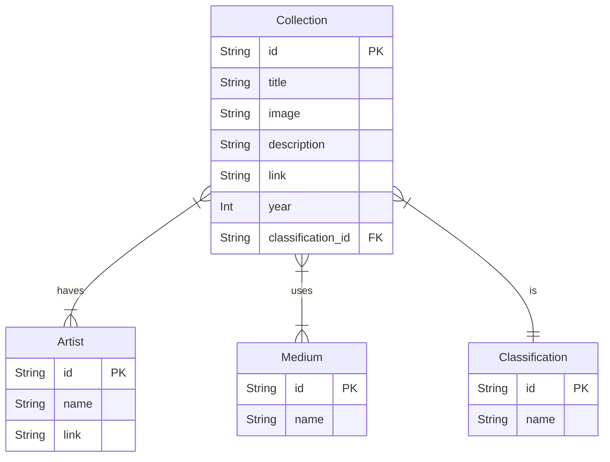

# galnas

Collection and API Documentation of Indonesian National Gallery. Built using Next.js

## Getting Started

First, run the development server:

```bash
# install dependecies
pnpm i

# run local server
pnpm dev
```

Open [http://localhost:3000](http://localhost:3000) with your browser to see the result.

## Features

- Filter
  - Medium
  - Classifications
- Search
  - Title
- Sort
  - Title
  - Year
- Pagination
  - Previous
  - Next
  - Total Rows
  - Total Page
  - Current Rows

## ER Diagram

Here's requirement:

- Each collection can be associated with multiple artists and mediums.
- Each artist can create multiple collections.
- Each medium can be used by multiple collections.


